# Information for Graders and Visitors

Hello! This is Group B (members: Xiaoyu Lu, Yonglin Wang, Zhuoran Huang) and welcome to our GitHub Repository. 

You can find the required submissions by clicking on the following links:

- [Annotation guidelines and instructions for annotators](/submissions/AnnotationGuidelines.pdf)
- [Final written report](/submissions/FinalProjectReport.pdf)
- [Final presentation slides](/submissions/FinalPresentation.pdf)
- [The Gold Standard Corpus](/code/data/gold_standard.csv) and [features extracted from the Gold Standard](/code/features_gold.csv)
- [A folder of code for the machine learning models](/code/models/)

----

# Information for Annotators

## Annotation Schema and Guildelines

See our regularly updated [guildelines](https://docs.google.com/document/d/1LZXOLTrth4FPP0_m9PauW0k9P-En9mYyvY4qOHSPs2I/edit?usp=sharing)

## Getting Started

First, thank you for helping us with the annotation. Our fate is somewhat in your hands now (and vice versa). Go team!

### How to use git for this task

- Fork this repo. 
  So you can have a personal copy. You can do anything to the copy without affecting the original one. 

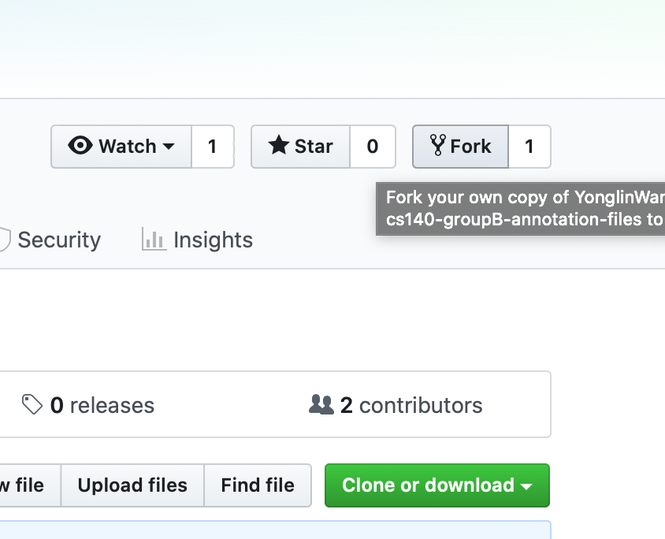

- Navigate to your copy of the repository and click the green "Clone or download" button. Click the clipboard next to the https clone URL to copy it.
  ```
  $ git clone <paste the URL here>
  ```
  
- 【Annotate your task】

- Create a new branch. `git checkout -b <branch name>`
  ```
  git checkout -b phase1-Annotator1
  ```
  
- add, commit and push the new branch.
  ```
  git add <your annotated tasks>
  git commit -m "<messages you wanna add>"
  git push -u origin <branch name>
  ```
  **CAVEAT**: only make changes to the file with the number you were allocated, otherwise your request may be rejected!
  
- Navigate to the original GitHub repository, and you should see a big green button marked "Compare and pull request". Click that button and you will be taken to a page giving you the opportunity to describe your pull request and showing you the changes you have made:

  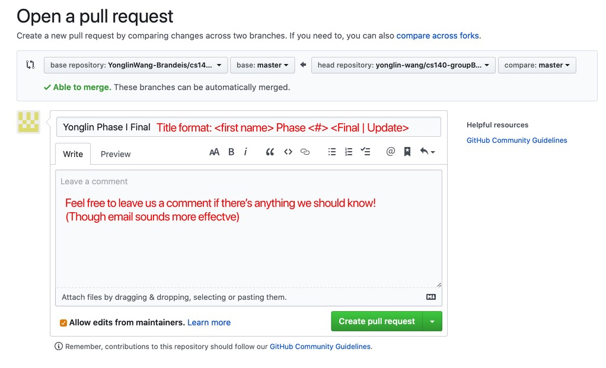

  Then, click the big green button `Create pull request`. 
  Done!


For more information, please check the [official website](https://archaeogeek.github.io/gettingstartedwithgit/github/pullrequest.html).

### First time using MAE

Click on ```MAE_2.2.10.jar``` in the root directory. (You might get a warning dialog, if you are using Mac.
Control-click ```MAE_2.2.10.jar```, then choose `Open` from the shortcut menu. Then, click `Open`.)

1. Choose `File`→`New Task Definition`:
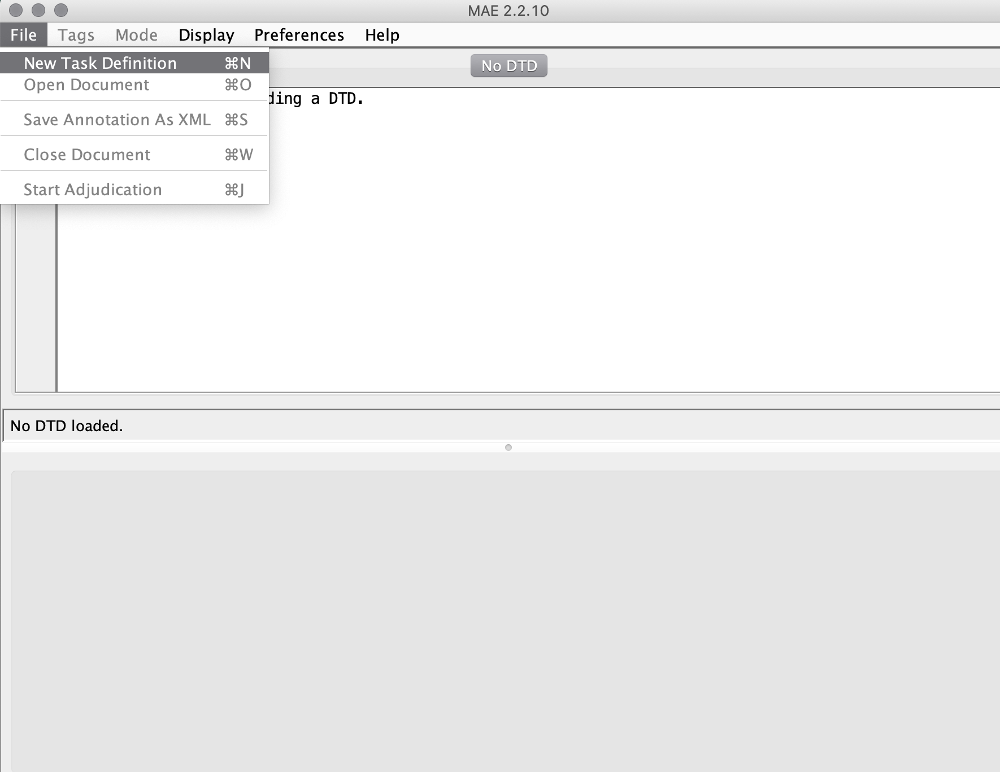

2. Choose the `TempRelTask.dtd`, click `Open`:
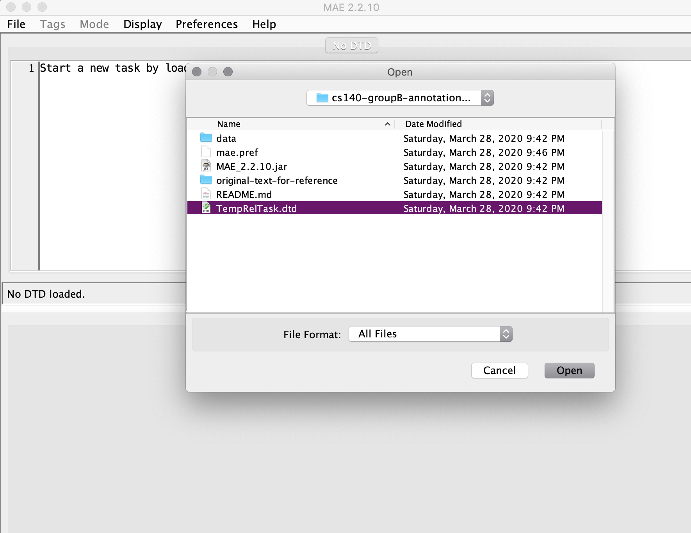

3. Click the `EVENT_ORDER` and tick the box:


4. Choose `File` →`Open Document`, then open the file assigned to you:
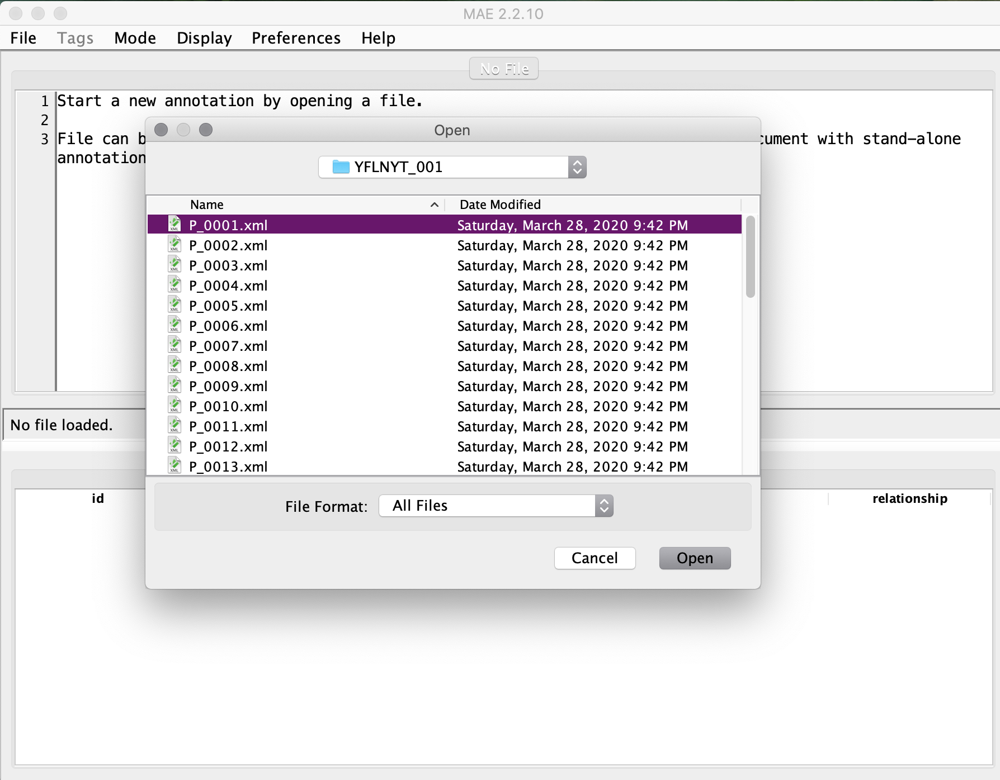

5. click `Yes`

   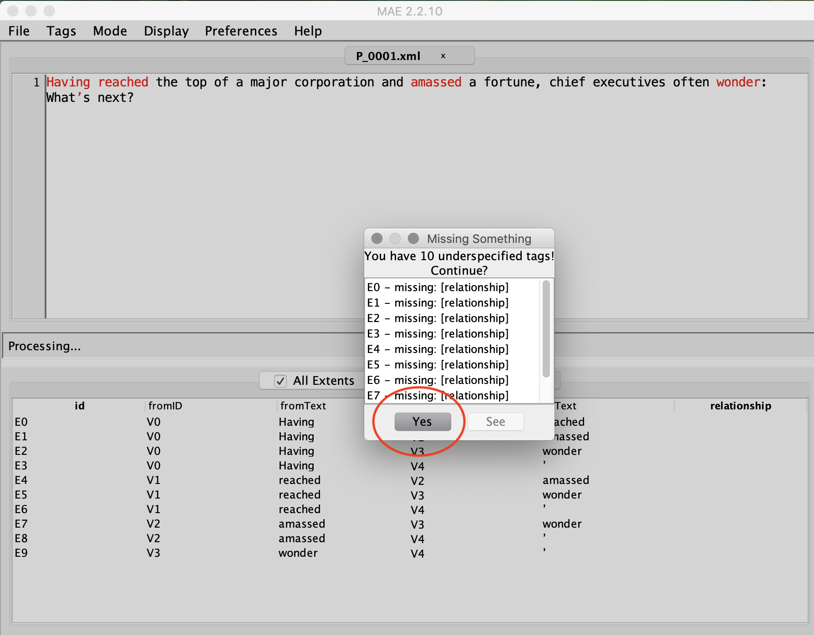


6. Begin your annotation journey!
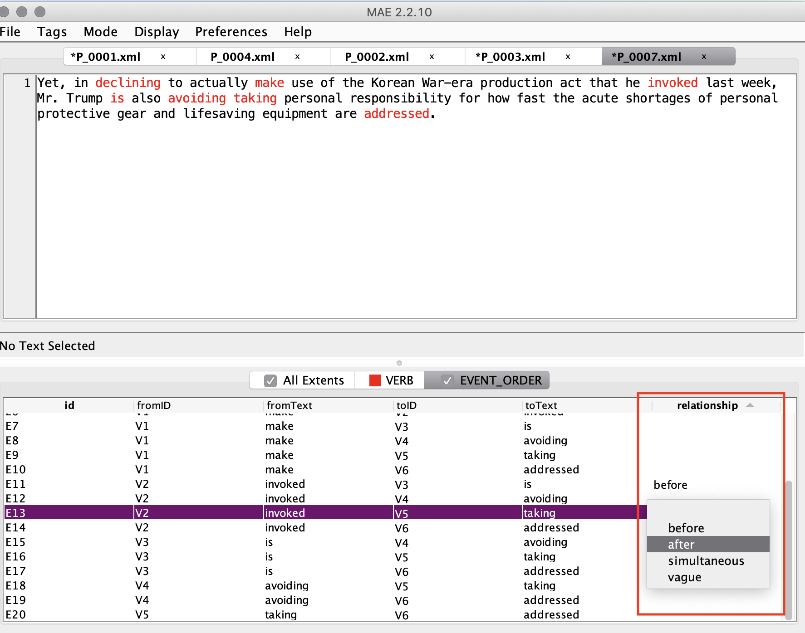


### How to delete
- Choose the word you want to delete, and you will see all the relations are highlighted automatically:
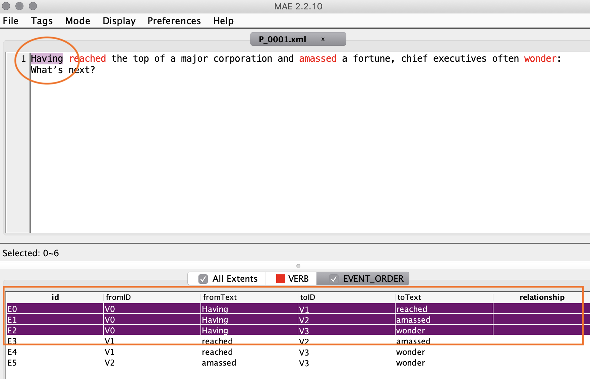

- Control-click, then choose `Delete <id> (word)` from the shortcut menu:
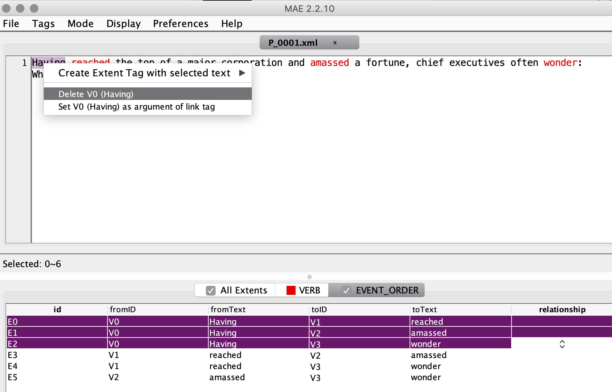

- Click `OK` to delete all the links connected to the word:
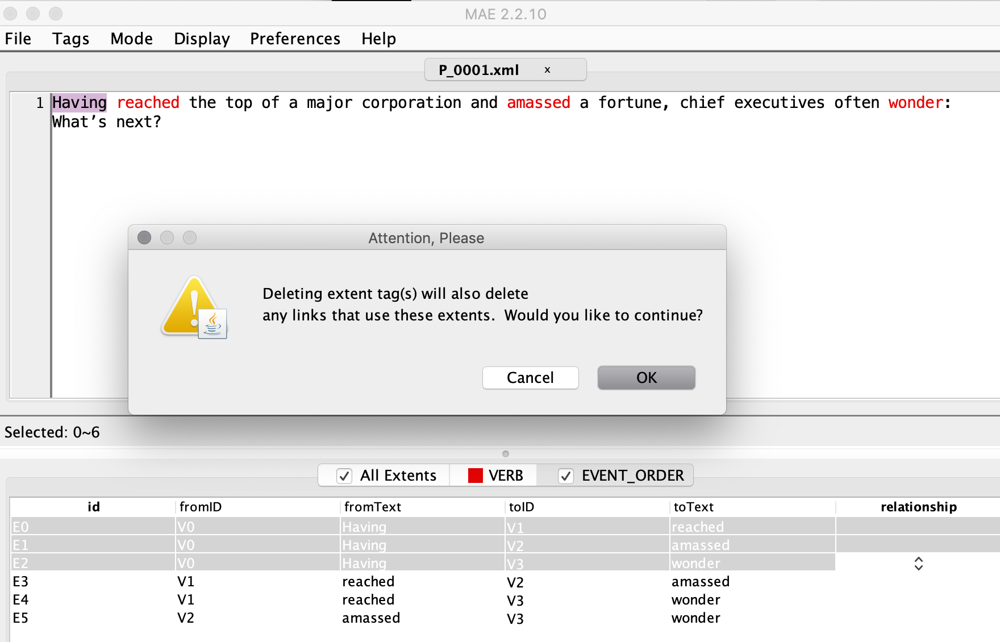

- You did it! (Please take note of which verb, which article and which paragraph of the article you delete in your txt file.)
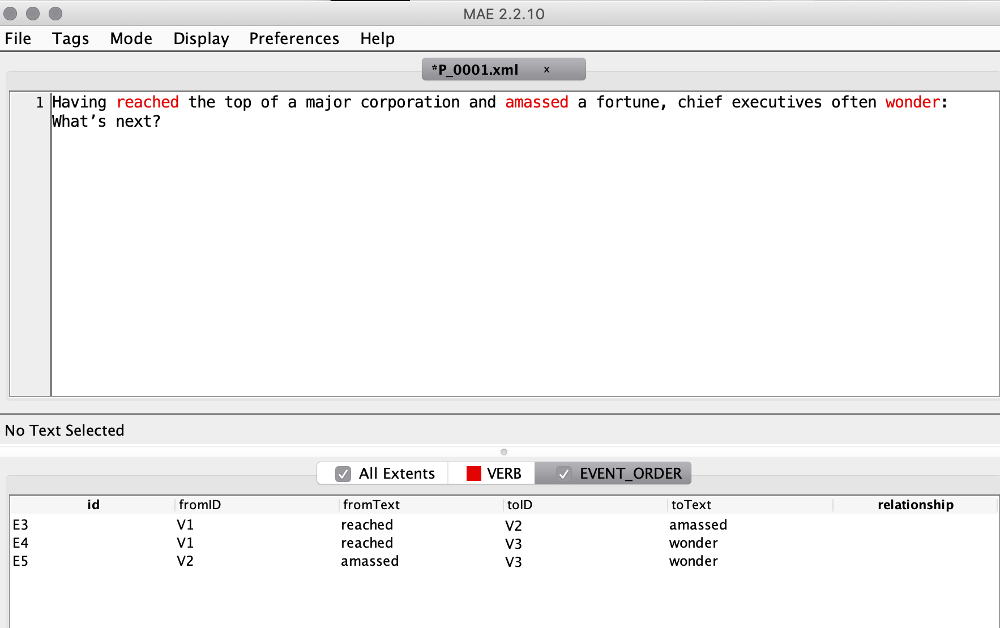
